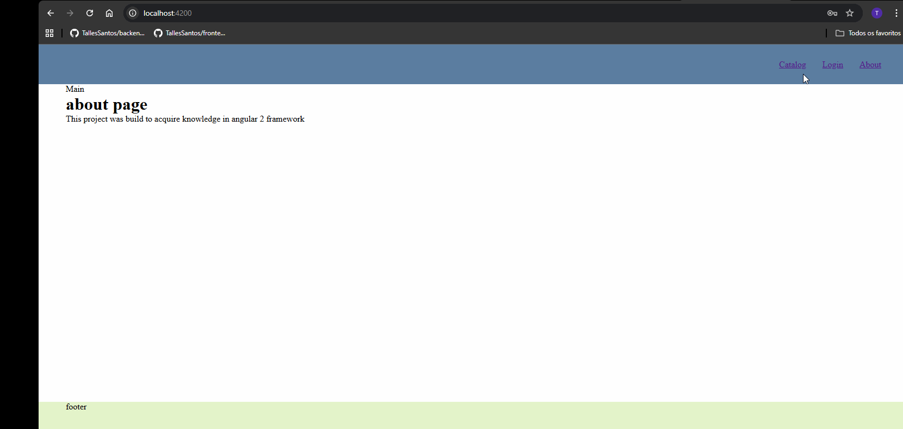

# 🎬 Frontend - Movie Rental Company

Frontend de uma aplicação de **locadora de filmes**, desenvolvida com **Angular**. Este projeto consome serviços REST e SOAP fornecidos por um backend separado.

---

## 📽️ Demonstração da Aplicação



---

## 🛠️ Tecnologias Utilizadas

- [Node.js](https://nodejs.org/) (para gerenciamento de dependências)
- [Angular CLI](https://angular.io/cli)

---

## ⚙️ Configuração de Ambiente

O projeto utiliza um arquivo para configuração de variáveis de ambiente:


Você deve configurar os endpoints do backend neste arquivo. Exemplo:

```ts
// URL base do servidor backend
export const SERVER_URL = "http://localhost:8080";

// Endpoints para autenticação
export const API_CREDENTIAL = {
  BASE_PATH: '/api-credentials/api',
  LOGIN: '/auth/login',
  SIGN_UP: 'auth/sign-up'
};

// Endpoints do sistema de locação de filmes
export const API_CURSER = {
  BASE_PATH: '/api-curser',
  SOAP: {
    MOVIE_PATH: '/MovieSoapService',
    CLIENT_PATH: '/ClientSoapService'
  },
  REST: {
    USER: {
      BASE_PATH: "/api/users",
      GET_CURRENT_USER: "/get-current-user",
      ADDRESSES: "/current-user/addresses",
      PHONES: "/current-user/phones"
    },
    CLIENT: {
      BASE_PATH: "/api/clients",
      RENT_HISTORY: "/current-user/rent-history",
      ADD_COMMENT: "/current-user/add-comment",
      UPDATE_COMMENT: "/current-user/update-comment",
      REMOVE_COMMENT: "/current-user/remove-comment"
    }
  }
};

```
## ⚙️Comandos do projeto :

### Para instalar o projeto:
 - ng install

### Para iniciar o projeto:
 - ng serve
 - acessar http://localhost:4200

